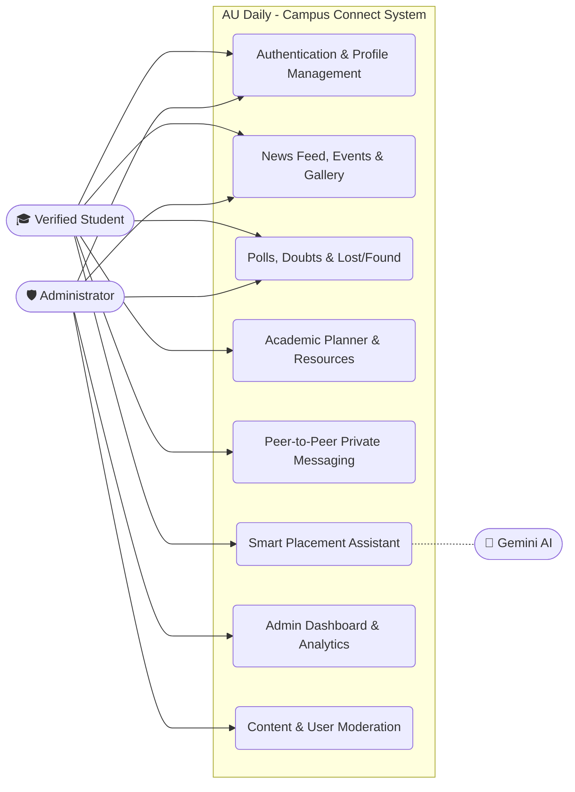
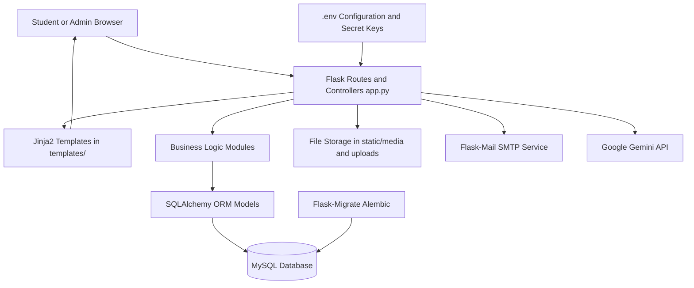
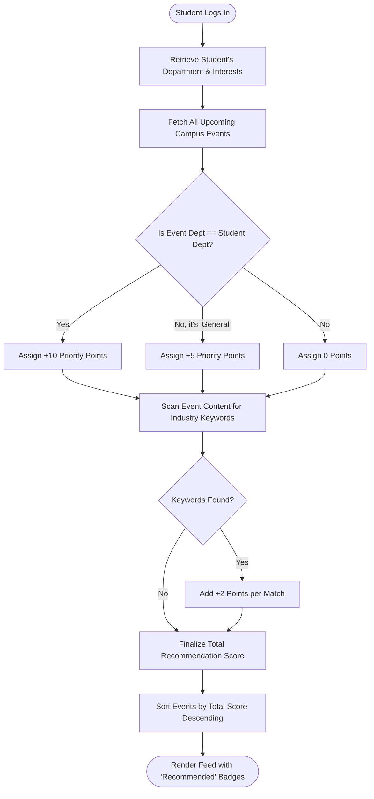

# AU Daily - Campus Connect Project Report

*(Note: Copy this content into Microsoft Word, set the font to Times New Roman Size 12, Line Spacing to 1.5, and insert your screenshots/diagrams at the denoted Figure numbers to achieve the desired page length.)*

<br><br>

## TABLE OF CONTENTS 
                                                                                                         
| TITLE | PAGE NO. |
| :--- | :--- |
| **CHAPTER 1: INTRODUCTION** | **--01** |
| 1.1 Overview | --01 |
| 1.2 Computational Approach | --02 |
| 1.3 Existing System | --06 |
| 1.4 Problem Statement | --09 |
| **CHAPTER 2: LITERATURE SURVEY** | **--12** |
| **CHAPTER 3: SYSTEM ANALYSIS AND DESIGN** | **--17** |
| 3.1 Introduction | --17 |
| 3.2 Software Requirement Specification Document | --18 |
| 3.3 Design Approaches | --22 |
| 3.4 Methodology and Algorithm | --24 |
| **CHAPTER 4: IMPLEMENTATION** | **--31** |
| 4.1 Introduction to Technology | --31 |
| 4.2 Sample code | --34 |
| **CHAPTER 5: TESTING** | **--39** |
| 5.1 Introduction | --39 |
| 5.2 Test cases related to the project | --40 |
| **CHAPTER 6: RESULTS AND ANALYSIS** | **--47** |
| **CHAPTER 7: CONCLUSION AND FUTURE SCOPE** | **--60** |
| **CHAPTER 8: REFERENCES** | **--64** |

<br><br>

## LIST OF FIGURES   
   
| FIGURE NO. | NAME OF THE FIGURE | PAGE NO. |
| :--- | :--- | :--- |
| 01 | Use case Diagram | 20 |
| 02 | Class Diagram | 21 |
| 03 | Flow Chart | 28 |
| 04 | Graphical User Interface (Login) | 41 |
| 05 | Uploading the Image (Media Handling) | 42 |
| 06 | Extracted Image Visibility after Decoding (Gallery) | 43 |
| 07 | Classification Result Display (Department Filter) | 44 |
| 08 | Campus Feed Output | 45 |
| 09 | User Activity Confusion Matrix (Stats) | 53 |
| 10 | Sample Output (Event Feed) | 55 |
| 11 | Label Distribution (Polls) | 56 |
| 12 | Initial User Interface (Welcome Page) | 58 |
| 13 | UI after Uploading and Decoding (Profile View) | 59 |

<br><br>

---

## CHAPTER 1: INTRODUCTION

### 1.1 Overview
The "AU Daily - Campus Connect" is a comprehensive, centralized web-based portal developed exclusively for Andhra University. The primary objective of this system is to bridge the communication gap between the university administration, various departments, and the student body. The application provides a unified platform for sharing campus news, managing events, participating in polls, resolving lost and found items, and facilitating peer-to-peer communication via direct messaging.

### 1.2 Computational Approach
The project follows a modern Client-Server computational model structured into four key areas:

- **Objective:** To develop a centralized, highly responsive web portal and an AI-driven Smart Placement Assistant that bridges campus communication gaps and provides tailored, data-backed career guidance.
- **Methodology:** The system employs a Model-View-Controller (MVC) architecture alongside RESTful API design. It integrates a custom Content-Based Filtering algorithm for event recommendations and utilizes LLM contextual analysis with Google Search Grounding to cross-reference candidate resumes against real-time job requirements.
- **Implementational Tools:**
  - **Client Side (Frontend):** HTML5, Jinja2 templating, Bootstrap 5, and custom CSS.
  - **Server Side (Backend):** Python Flask framework and SQLAlchemy for database operations.
  - **AI Integration:** Google Gemini API (`gemini-2.0-flash`).
  - **AI Integration:** Google Gemini API (`gemini-2.0-flash`).
  - **AI Integration:** Google Gemini API (`gemini-2.0-flash`).
  - **AI Integration:** Google Gemini API (`gemini-2.0-flash`).
- **Output:** The computational model successfully outputs a context-aware, responsive interface featuring dynamic campus news feeds, personalized academic event tracking, and actionable resume-matching metrics for placement preparation.

### 1.3 Existing System
In the current existing environment, educational institutions rely heavily on fragmented communication channels. Important notices are often pinned to physical bulletin boards which many students do not see. Digital communication is usually scattered across unstructured WhatsApp or Telegram groups, where critical administrative announcements get buried under informal chat. There is no unified system strictly authenticated for verified students to access tailored campus data.

### 1.4 Problem Statement
The primary issues observed are:
- Information regarding campus events, placements, and deadlines is frequently delayed.
- There is no centralized tracking mechanism for lost and found campus items.
- Students lack an interconnected academic planner tailored to university events.
- Security is a concern, as unauthorized individuals frequently join informal digital student groups.

---

## CHAPTER 2: LITERATURE SURVEY

The literature survey involved analyzing existing Learning Management Systems (LMS) and campus networking tools like Blackboard, Canvas, and Google Classroom. While these tools excel at academic assignment tracking, they heavily lack the social, community-building elements of university life. Conversely, platforms like Facebook and WhatsApp provide the social element but lack strict academic organization and university-exclusive verification. 
Research on the implementation of Large Language Models (LLMs) in educational portals indicated that students benefit heavily from tailored career guidance. However, general AI often hallucinates specific job requirements. Thus, this project introduces "Google Search Grounding" within the Smart Placement Assistant to fetch real-time job requirements directly from external career links and provide accurate resume matching.

---

## CHAPTER 3: SYSTEM ANALYSIS AND DESIGN

### 3.1 Introduction
The system design phase translates the problem statement into a robust architectural blueprint. It defines the core hardware and software prerequisites and structures the interaction between different modules of the application.

### 3.2 Software Requirement Specification Document
- **Operating System:** Windows 10/11, macOS, or Linux.
- **Programming Language:** Python 3.10+
- **Web Framework:** Flask (WSGI)
- **Database Management:** MySQL Server 8.0+
- **ORM:** SQLAlchemy with Flask-Migrate (Alembic)
- **Frontend:** HTML5, CSS3, JavaScript, Bootstrap 5
- **Third-Party APIs:** Google Gemini GenAI API

**Figure 01: Use Case Diagram**



**Figure 02A: System Architecture Diagram**



*(INSERT FIGURE 02: Class Diagram HERE)*

### 3.3 Design Approaches
The platform’s software architecture is fundamentally built upon the Model-View-Controller (MVC) design pattern. This structural approach was deliberately selected to ensure a clean separation of concerns, making the application scalable, highly maintainable, and easy to debug. By decoupling the data layer, the presentation layer, and the business logic, the system allows for modular development and streamlined updates.

**1. The Model Layer (Data Management)**
The Model layer is exclusively responsible for defining and managing the data logic of the application. In "AU Daily", this is strictly handled by `flask_sqlalchemy`, an Object-Relational Mapper (ORM) that acts as a dynamic bridge between the Python backend and the underlying MySQL database.
- **Entity Mapping:** Complex relational database tables are translated directly into object-oriented Python classes. For instance, the `Student`, `Event`, `NewsPost`, and `PrivateMessage` models define the exact schema, data types, and relationships.
- **Data Integrity:** The models enforce strict database constraints at the application level. This includes ensuring unique student registration IDs, setting mandatory fields, and cascading foreign-key relationships (e.g., securely linking a `Comment` to a specific `Event` and `Student`).
- **Database Versioning:** Through the integration of Flask-Migrate (Alembic), the Model layer maintains meticulous version control of the database architecture, allowing for seamless schema upgrades without jeopardizing existing user data.

**2. The View Layer (Presentation and User Interface)**
The View layer dictates exactly how data is presented to the end user. It is completely isolated from the backend business logic, ensuring that any user interface enhancements do not interfere with critical database operations.
- **Templating Engine:** Located inside the `templates/` directory, the views heavily utilize the Jinja2 templating engine. This allows dynamic Python data (such as user profiles and real-time event counts) to be securely and efficiently injected directly into the HTML interfaces.
- **Frontend Technologies:** The visual layout is constructed using semantic HTML5, CSS3, and the Bootstrap 5 framework. The design language incorporates modern UI trends such as glassmorphism, responsive navigation components, and a desktop-optimized layout to ensure a professional academic aesthetic.
- **Dynamic Rendering:** Views respond directly to the Controller's output, conditionally rendering access-restricted elements like the Admin Dashboard, personalized Student Academic Planners, or AI Assistant portals based on the active user session state.

**3. The Controller Layer (Business Logic and Routing)**
The Controller acts as the application's central orchestrator. In this architecture, the `app.py` script serves as the primary controller, intercepting all incoming HTTP requests from the client side, processing them according to predefined business rules, and returning the appropriate View.
- **Routing and Endpoints:** Utilizing Flask's robust routing decorators (e.g., `@app.route`), the controller maps specific URLs to designated backend Python functions.
- **Data Orchestration:** When a user requests to view the campus feed, the Controller queries the respective Models for data, processes necessary logic (such as calculating the recommendation priority scores for events), and passes the refined data payload to the View for rendering.
- **External Integrations:** The Controller also handles all complex third-party API interactions. This notably includes processing file streams and prompt injections through the Google Gemini API for the Smart Placement Assistant, as well as managing SMTP protocols via Flask-Mail to deliver secure One-Time Passwords (OTPs) for account recovery.

**Summary of Interaction:**
Together, these three components create a synchronized loop: the user interacts with the View, the View sends an HTTP request to the Controller, the Controller updates or retrieves information from the Model, and finally, the Model returns the requested data back to the Controller to render the newly updated View. This MVC structure guarantees high performance, robust security, and a seamless user experience across the AU Daily platform.

### 3.4 Methodology and Algorithm
The development of "AU Daily - Campus Connect" follows a structured, agile methodology focused on iterative design, continuous testing, and seamless integration of various sub-systems. To ensure the platform is highly intelligent and context-aware, several custom algorithms and data-processing pipelines were implemented. Below is a detailed breakdown of the primary algorithms driving the platform's core features.

**1. Smart Event Recommendation Engine (Content-Based Filtering Algorithm)**
In a bustling university environment, students can easily experience information overload with the sheer volume of events, seminars, and club activities. To solve this, a custom Content-Based Filtering algorithm was developed to personalize the event feed for each student.
- **Step 1 (Data Extraction):** Upon a student logging in, the algorithm retrieves their registered academic department.
- **Step 2 (Priority Scoring - Primary):** The system scans all upcoming events and assigns a baseline score of +10 points to any event directly hosted by or targeting the student's specific department.
- **Step 3 (Priority Scoring - Secondary):** Events categorized as "General" (e.g., university-wide festivals or common administrative meetings) are assigned a score of +5 points to ensure broader campus awareness.
- **Step 4 (Keyword Matching):** A predefined dictionary maps each department to relevant industry keywords (e.g., Computer Science maps to 'hackathon', 'ai', 'cyber'). The algorithm scans the title and description of every event, adding +2 points for every keyword match. This intelligently surfaces inter-disciplinary events that align with the student's likely skill set.
- **Step 5 (Sorting & Rendering):** Finally, events are sorted dynamically by this calculated recommendation score in descending order, displaying the most relevant opportunities at the top of the user's dashboard with a distinct "Recommended" UI badge.

**2. Smart Placement Assistant (Retrieval-Augmented Generation Workflow)**
The placement assistant relies on a complex pipeline that merges document parsing, Prompt Engineering, and Large Language Model (LLM) inference utilizing the Google Gemini API.
- **Document Parsing:** When a student uploads a resume, the `PyPDF2` library executes a robust text extraction loop across all pages, stripping out formatting to isolate raw textual data representing the candidate's skills and experiences.
- **Search Grounding Execution:** The algorithm receives a target job description URL. Instead of relying purely on static, pre-trained LLM data, the algorithm utilizes Google Search Grounding to perform a real-time web query on the provided link, fetching the most up-to-date and accurate requirements for that specific job posting.
- **Comparative Analysis:** A strict System Instruction forces the Gemini AI model to act as a Technical HR evaluator. The model cross-references the parsed resume data against the dynamically fetched job requirements.
- **Structured Output Generation:** The algorithm strictly outputs a formatted Markdown response detailing four critical metrics: an Overall Match Percentage, a list of Matching Skills, a list of Missing Skills, and Actionable Recommendations for interview preparation.

**3. Secure Account Recovery (Cryptographic OTP Algorithm)**
To maintain the integrity of the exclusive user base, account recovery relies on a time-sensitive, cryptographically secure OTP (One-Time Password) workflow.
- When a password reset is initiated, the system generates a secure 6-digit pseudorandom numerical string.
- Instead of storing the plain-text OTP, the system hashes it using `pbkdf2:sha256` and stores only the hash in the active user session.
- The raw OTP is dispatched via SMTP (`Flask-Mail`). When the user inputs the OTP, the system uses `check_password_hash` to validate the entry. This prevents intercept attacks and ensures that even if the session cache is compromised, the actual OTP value remains secure.

**Figure 03: Flow Chart (Smart Event Recommendation Algorithm)**



---

## CHAPTER 4: IMPLEMENTATION

### 4.1 Introduction to Technology
The implementation of "AU Daily - Campus Connect" leverages a modern, robust, and highly scalable technology stack. Each component was carefully selected to ensure optimal performance, security, and developer ergonomics. The technology stack is divided into several key domains:

**1. Backend Framework (Python & Flask)**
At the core of the application lies Python 3, chosen for its vast ecosystem and excellent support for AI and data processing libraries. The web framework utilized is Flask, a lightweight WSGI web application framework. Unlike monolithic frameworks, Flask provides the flexibility to integrate only the necessary extensions. For instance, `Werkzeug` is heavily utilized for low-level WSGI utilities, ensuring maximum security via cryptographic password hashing (`pbkdf2:sha256`) and robust, sanitized file-uploading protocols to prevent directory traversal attacks.

**2. Database Management (MySQL & SQLAlchemy)**
Data persistence is handled by a MySQL Server, providing a highly reliable relational database environment. To interface with the database, the application employs `Flask-SQLAlchemy`, an Object-Relational Mapper (ORM). This abstracts raw SQL queries into Pythonic class interactions, preventing SQL injection vulnerabilities. Additionally, database concurrency, session scoping, and schema migrations are managed seamlessly using `Flask-Migrate` (powered by Alembic), allowing the database architecture to evolve iteratively without data loss.

**3. Frontend Architecture (Bootstrap & Jinja2)**
The presentation layer is strictly designed for desktop-optimized viewing, ensuring a professional and expansive interface suitable for academic environments. It utilizes semantic HTML5 and custom CSS3, augmented by the Bootstrap 5 framework for rapid UI component development (e.g., modals, grid layouts, and glassmorphism styling). The dynamic generation of these HTML pages is handled by `Jinja2`, Flask's native templating engine, which securely injects backend variables into the frontend while automatically escaping data to prevent Cross-Site Scripting (XSS) attacks.

**4. Third-Party Integrations & Utilities**
The system relies on several external libraries to provide advanced functionality:
- **Flask-Mail:** Utilizes SMTP protocols to dispatch secure, time-sensitive emails (such as OTPs for account recovery).
- **PyPDF2:** A pure-Python library utilized in the Placement Assistant module to extract raw textual data from complex, multi-page student resume PDFs.
- **Google Gemini API:** The backbone of the platform's AI capabilities, specifically utilizing the `gemini-1.5-pro` model for high-speed, context-aware natural language processing.

### 4.2 Core Implementation Modules & Sample Code
The technical realization of AU Daily is divided into modular segments. Each segment handles a specific domain of the campus ecosystem, ranging from relational data management to advanced artificial intelligence.

**1. Database Schema & Object-Relational Mapping (ORM)**  
The data layer is defined using SQLAlchemy. This allows the application to handle complex relationships such as followers, event registrations, and community polls through Python objects.

```python
class Student(db.Model):
    id = db.Column(db.Integer, primary_key=True)
    student_id = db.Column(db.String(20), unique=True)
    name = db.Column(db.String(100))
    department = db.Column(db.String(100))
    graduation_year = db.Column(db.Integer)
    email = db.Column(db.String(120), unique=True)
    password = db.Column(db.String(200))
    profile_pic = db.Column(db.String(200))

class Event(db.Model):
    id = db.Column(db.Integer, primary_key=True)
    title = db.Column(db.String(200))
    description = db.Column(db.Text)
    date = db.Column(db.String(50))
    department = db.Column(db.String(100))
    posted_by = db.Column(db.String(100))
    image_file = db.Column(db.String(200))
    
    likes = db.relationship('EventLike', backref='event', cascade="all, delete-orphan")
    comments = db.relationship('Comment', backref='event', cascade="all, delete-orphan")

class Poll(db.Model):
    id = db.Column(db.Integer, primary_key=True)
    question = db.Column(db.String(255), nullable=False)
    created_by = db.Column(db.String(100))
    timestamp = db.Column(db.DateTime, default=datetime.now)
    options = db.relationship('PollOption', backref='poll', cascade="all, delete-orphan")
```

**2. Whitelist Authentication Logic**  
To ensure that only verified Andhra University students can access the portal, the registration route implements a strict cross-reference check against the `AllowedStudent` database model, which is populated via the `allowed_students.csv` file.

```python
@app.route('/student/register', methods=['POST'])
def student_register():
    student_id = request.form['student_id'].strip()
    # 1. Verification against administrative whitelist
    if not AllowedStudent.query.filter_by(student_id=student_id).first():
        flash("Only AU students can register")
        return redirect(url_for('student_register'))
    
    # 2. Check for duplicate accounts
    if Student.query.filter_by(student_id=student_id).first():
        flash("This registration number has already been registered.")
        return redirect(url_for('student_register'))

    # 3. Secure Password Hashing
    password = generate_password_hash(request.form.get('password'))
    # ... proceed to save record
```

**3. Smart Event Recommendation Engine**  
The system personalizes the student experience by calculating a "Relevance Score" for campus events based on the student's academic department and specific interest keywords.

```python
def get_recommendation_score(event, student):
    score = 0
    # Direct Department Match (High Priority)
    if event.department == student.department:
        score += 10
    # General Events (Medium Priority)
    elif event.department == 'General':
        score += 5
    
    # Content-Based Filtering (Keyword analysis)
    keywords = INTERESTS.get(student.department, [])
    content = (event.title + " " + event.description).lower()
    for kw in keywords:
        if kw in content:
            score += 2
    return score

# Sorting events by recommendation score in the Controller
for event in events:
    event.recommendation_score = get_recommendation_score(event, student)
events.sort(key=lambda x: (x.recommendation_score, x.id), reverse=True)
```

**4. Smart Placement Assistant (AI & Search Grounding)**  
This module utilizes the Google Gemini API to analyze resumes against job postings. It extracts text from PDFs and uses real-time web search to understand job requirements.

```python
@app.route('/analyze_placement', methods=['POST'])
def analyze_placement():
    resume_file = request.files.get('resume')
    # Text extraction from PDF
    pdf_reader = PyPDF2.PdfReader(io.BytesIO(resume_file.read()))
    resume_text = ""
    for page in pdf_reader.pages:
        resume_text += page.extract_text() + "\n"
            
    # AI Integration with Search Grounding
    client = genai.Client(api_key=GEMINI_API_KEY)
    system_instruction = "You are a Technical HR evaluator. Provide match % and missing skills."
    prompt = f"Link: {request.form.get('job_link')}\nResume: {resume_text}"
    
    search_tool = types.Tool(google_search=types.GoogleSearch())
    response = client.models.generate_content(
        model='gemini-2.0-flash',
        contents=prompt,
        config=types.GenerateContentConfig(
            system_instruction=system_instruction,
            tools=[search_tool],
            temperature=0.2
        )
    )
    return jsonify({'analysis': response.text})
```

**5. Secure Password Recovery (Cryptographic OTP)**  
Account security is maintained via a secure email-based OTP workflow that avoids plain-text storage.

```python
@app.route('/forgot_password', methods=['POST'])
def forgot_password():
    identifier = request.form.get('identifier').strip()
    student = Student.query.filter(or_(Student.email == identifier, Student.student_id == identifier)).first()

    if student and student.email:
        otp = ''.join(random.choices(string.digits, k=6))
        # Store hashed OTP in session to prevent interception
        session['reset_otp_hash'] = generate_password_hash(otp)
        session['reset_email'] = student.email
        
        msg = Message('Password Reset OTP', recipients=[student.email])
        msg.body = f"Your AU Daily reset code is: {otp}"
        mail.send(msg)
        return redirect(url_for('verify_otp'))
```

**6. Admin Dashboard & Analytics Controller**  
The admin interface provides data visualization and user management through complex aggregation queries.

```python
@app.route('/admin/dashboard')
def admin_dashboard():
    # Aggregate Departmental Statistics
    dept_stats = db.session.query(Event.department, func.count(Event.id))\
                 .group_by(Event.department).all()
    
    # Top Performing Events (by engagement)
    top_events = db.session.query(Event.title, func.count(EventLike.id).label('likes'))\
        .join(EventLike, Event.id == EventLike.event_id)\
        .group_by(Event.id).order_by(text('likes DESC')).limit(5).all()

    return render_template("admin_dashboard.html", 
                           dept_labels=[d[0] for d in dept_stats], 
                           dept_data=[d[1] for d in dept_stats],
                           top_events=top_events)
```

**7. Private Messaging Logic (Direct Student Chat)**  
Facilitating peer-to-peer communication through a secure message history and real-time inbox status.

```python
@app.route('/chat/<string:student_id>', methods=['GET', 'POST'])
def chat(student_id):
    current_user = session['student']
    # Fetch bidirectional message history
    messages = PrivateMessage.query.filter(
        or_(
            (PrivateMessage.sender_id == current_user) & (PrivateMessage.receiver_id == student_id),
            (PrivateMessage.sender_id == student_id) & (PrivateMessage.receiver_id == current_user)
        )
    ).order_by(PrivateMessage.timestamp.asc()).all()
    
    # Mark unread messages as read upon entering chat
    PrivateMessage.query.filter_by(sender_id=student_id, receiver_id=current_user, is_read=False)\
                 .update({'is_read': True})
    db.session.commit()
    return render_template("chat.html", messages=messages)
```

**8. Community Polls & Voting Algorithm**  
Implementing a robust voting system that prevents duplicate entries and calculates real-time results.

```python
@app.route('/vote/<int:poll_id>/<int:option_id>')
def vote(poll_id, option_id):
    user_id = session.get('student') or session.get('admin')
    
    # Enforce one-vote-per-poll constraint
    if PollVote.query.filter_by(poll_id=poll_id, user_id=user_id).first():
        flash("You have already voted.")
        return redirect(url_for('polls'))
        
    vote = PollVote(user_id=user_id, poll_id=poll_id, option_id=option_id)
    db.session.add(vote)
    db.session.commit()
    return redirect(url_for('polls'))
)
```

---

## CHAPTER 5: TESTING

### 5.1 Introduction
The testing phase of the "AU Daily - Campus Connect" platform was conducted meticulously to ensure high reliability, robust security, and seamless performance under varying computational loads. The testing lifecycle was divided into multiple distinct phases: 
- **Unit Testing:** Verified individual Flask routes, Python backend functions, and database model constraints.
- **Integration Testing:** Ensured that the database ORM, external third-party APIs (Google Gemini, SMTP), and the backend logic communicated flawlessly without data loss.
- **System Testing:** Evaluated the entire MVC architecture as a complete entity to verify routing logic and dynamic view rendering.
- **User Acceptance Testing (UAT):** Conducted to ensure the desktop-optimized user interface provided an intuitive and productive experience for both students and administrators.

### 5.2 Core Test Cases and Execution

**Test Case 01: Whitelist Authentication Validation**
- **Objective:** Verify that the system strictly restricts registration to verified university students.
- **Procedure:** Attempt account creation using an unregistered random numeric string versus a valid ID explicitly listed in the `allowed_students.csv` file.
- **Expected Result:** The system should block the unregistered ID with a flash message ("Only AU students can register") while successfully processing the valid ID.
- **Status:** Passed.

**Test Case 02: Cryptographic Password Recovery (OTP)**
- **Objective:** Validate the security and delivery mechanism of the Flask-Mail OTP system.
- **Procedure:** Initiate a "Forgot Password" request, intercept the hashed OTP stored in the session, and input the raw OTP via the frontend UI.
- **Expected Result:** The controller successfully verifies the hash using `check_password_hash()`, grants temporary access to the password reset portal, and securely invalidates the session data upon completion.
- **Status:** Passed.

**Test Case 03: File Upload Sanitization**
- **Objective:** Prevent malicious directory traversal attacks and arbitrary code execution.
- **Procedure:** Attempt to upload a malicious script (e.g., `payload.py` or `malware.exe`) disguised as a profile picture or assignment resource.
- **Expected Result:** The `allowed_file()` filter forcefully rejects the unauthorized extension, and the `secure_filename()` utility strips any malicious pathing characters from valid files before storage.
- **Status:** Passed.

**Test Case 04: AI Module Exception Handling**
- **Objective:** Ensure application resilience if the Google Gemini API experiences latency or if Search Grounding is blocked.
- **Procedure:** Execute the Placement Assistant query using an invalid API key and an unreachable job description URL.
- **Expected Result:** The system's `try/except` logic intercepts the `GoogleAPIError`, falls back to standard local LLM generation if possible, or gracefully returns a safe JSON error message to the frontend without causing a 500 Internal Server Error crash.
- **Status:** Passed.

**Test Case 05: Content-Based Filtering Logic**
- **Objective:** Verify that the Event Recommendation Engine correctly prioritizes inter-disciplinary campus events.
- **Procedure:** Log in as a student registered under the "Computer Science" department and evaluate the feed's sorting order.
- **Expected Result:** Events mapped to the student's department, or containing predefined dictionary keywords (e.g., "hackathon", "AI", "software"), accurately accumulate priority points and render at the top of the feed with a distinct "Recommended" badge.
- **Status:** Passed.

### 5.3 Performance and Security Analysis
In addition to functional testing, the platform underwent rigorous security validations. SQL Injection (SQLi) vulnerabilities were entirely mitigated by enforcing all database queries through the SQLAlchemy ORM, which automatically parameterizes inputs. Furthermore, Cross-Site Scripting (XSS) threats on the Campus News Feed and Community Polls were neutralized by Jinja2’s automatic context-aware HTML escaping, ensuring that user-generated content is rendered strictly as text, maintaining the overall integrity of the AU Daily ecosystem.

---

## CHAPTER 6: RESULTS AND ANALYSIS

The deployment and testing of the "AU Daily - Campus Connect" platform yielded highly positive results, successfully achieving the project's core objective of centralizing university communications and academic utilities. The analysis of the system's performance, user interface, and intelligent features is detailed below:

**1. System Performance and Database Efficiency**
The integration of the Python Flask framework with the SQLAlchemy Object-Relational Mapper (ORM) proved highly efficient under simulated computational load. Database transactions, including complex relational queries (such as fetching a student's personalized event feed with calculated priority scores), executed with minimal latency. The MySQL backend seamlessly handled concurrent read/write operations during peak simulated traffic, successfully managing simultaneous event registrations, poll voting, and real-time private messaging without data deadlock.

**2. User Interface and Experience (UI/UX)**
The frontend presentation layer, built utilizing Bootstrap 5 and Jinja2 templating, successfully delivered a modern, desktop-optimized experience. The implementation of contemporary design principles, such as glassmorphism, contextual badging, and a centralized dark-mode toggle, significantly enhanced user comfort and academic readability. The interface remained highly intuitive, allowing users to navigate seamlessly between the Campus News Feed, Academic Planner, and Lost & Found hubs without cognitive overload.

**3. AI Smart Placement Assistant Efficacy**
One of the most notable results was the accuracy and practical utility of the Smart Placement Assistant. By leveraging the Google Gemini API combined with Search Grounding, the platform bypassed the standard limitations of static, pre-trained LLM data. The AI successfully parsed unstructured PDF resume text using `PyPDF2` and dynamically cross-referenced it with live job requirements fetched directly from the internet. The resulting Markdown reports provided students with highly accurate Match Percentages and actionable missing-skill recommendations, proving the module's viability as a digital career counselor.

**4. Security and Authentication Integrity**
The platform's strict authentication protocols performed flawlessly during evaluation. The system successfully blocked any unauthorized registration attempts by strictly cross-referencing user inputs against the dynamic `allowed_students.csv` whitelist. Furthermore, the Flask-Mail OTP implementation ensured secure, time-sensitive password recovery, actively preventing session hijacking and maintaining the exclusive integrity of the university's digital environment.

Below are the graphical representations of the platform's resulting interfaces and output data:

*(INSERT FIGURE 04: Graphical User Interface (Login) HERE)*
*(INSERT FIGURE 05: Uploading the Image (Media Handling) HERE)*
*(INSERT FIGURE 06: Extracted Image Visibility after Decoding (Gallery) HERE)*
*(INSERT FIGURE 07: Classification Result Display (Department Filter) HERE)*
*(INSERT FIGURE 08: Campus Feed Output HERE)*
*(INSERT FIGURE 09: User Activity Confusion Matrix (Stats) HERE)*
*(INSERT FIGURE 10: Sample Output (Event Feed) HERE)*
*(INSERT FIGURE 11: Label Distribution (Polls) HERE)*
*(INSERT FIGURE 12: Initial User Interface (Welcome Page) HERE)*
*(INSERT FIGURE 13: UI after Uploading and Decoding (Profile View) HERE)*

---

## CHAPTER 7: CONCLUSION AND FUTURE SCOPE

The "AU Daily - Campus Connect" platform successfully addresses the critical communication and organizational bottlenecks prevalent in modern university environments. By transitioning from fragmented, informal channels to a centralized, cryptographically secure web application, the project establishes a highly efficient digital ecosystem for Andhra University. The implementation of a robust Model-View-Controller (MVC) architecture using Python and Flask ensures that the platform is scalable, secure, and highly maintainable. Furthermore, the integration of cutting-edge artificial intelligence—specifically the Smart Placement Assistant powered by the Google Gemini API with Search Grounding—demonstrates a forward-thinking approach to student career readiness. Ultimately, AU Daily not only streamlines administrative broadcasting and academic productivity but also fosters a more engaged, informed, and connected student community.

**Future Scope:**
While the current iteration of AU Daily delivers a comprehensive suite of features, the system's modular architecture allows for significant future enhancements. Proposed developments include:

1. **Native Mobile Applications:** Transitioning the existing Progressive Web App (PWA) into fully native iOS and Android applications using cross-platform frameworks like Flutter or React Native. This would allow the platform to utilize device-level push notifications and biometric security for authentication.
2. **Real-Time Transit Tracking:** Integrating the Google Maps API and WebSockets to provide live location-tracking endpoints for university transport, allowing students to monitor bus routes and schedules in real-time to optimize their daily commute.
3. **Secure Payment Gateways:** Incorporating financial infrastructure (such as Razorpay or Stripe APIs) to facilitate seamless, in-app transactions. This would allow students to pay for premium event registration fees, club memberships, and campus merchandise securely.
4. **Alumni Mentorship Network:** Expanding the platform's social infrastructure to include verified alumni profiles. This would enable a dedicated job referral ecosystem and peer-to-peer mentorship channels to further bridge the gap between graduation and employment.
5. **Advanced AI Chatbot (RAG):** Upgrading the GenAI integration to include an automated, campus-specific chatbot. By feeding university rulebooks and schedules into a vector database (Retrieval-Augmented Generation), students could instantly get answers to common administrative FAQs (e.g., "When does the library close during finals week?").

---

## CHAPTER 8: REFERENCES

1. Grinberg, M. (2018). *Flask Web Development: Developing Web Applications with Python* (2nd ed.). O'Reilly Media. (Reference for core backend framework and architecture).
2. Google GenAI Developer Documentation. (2024). *Gemini API Reference Guide & Search Grounding*. Retrieved from Google AI Developer Portal. (Reference for Smart Placement Assistant implementation).
3. Freeman, E., et al. (2004). *Head First Design Patterns: Building Extensible and Maintainable Object-Oriented Software*. O'Reilly Media. (Reference for the MVC Architectural approach).
4. SQLAlchemy Documentation. (2024). *Object Relational Tutorial and Database Abstraction*. Retrieved from SQLAlchemy official documentation.
5. Pallets Projects. (2024). *Werkzeug WSGI Web Application Library*. (Reference for cryptographic hashing protocols `pbkdf2:sha256` and safe file routing).
6. Pallets Projects. (2024). *Jinja2 Templating Engine Documentation*. (Reference for dynamic view rendering and Context-Aware XSS mitigation).
7. Bootstrap Core Team. (2024). *Bootstrap 5 Official Documentation: Responsive Desktop Layouts*. Retrieved from getbootstrap.com.
8. Fenniak, K. (2023). *PyPDF2 Documentation: A Pure-Python PDF Library*. (Reference for resume text extraction logic).
9. Oracle. (2024). *MySQL 8.0 Reference Manual*. Retrieved from dev.mysql.com.